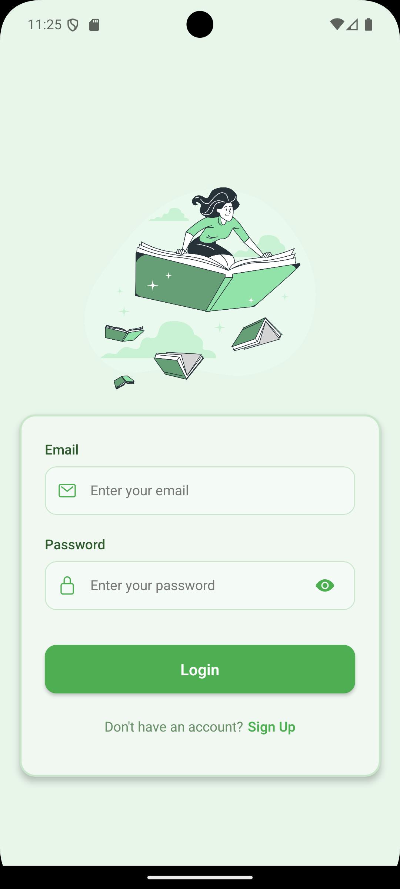
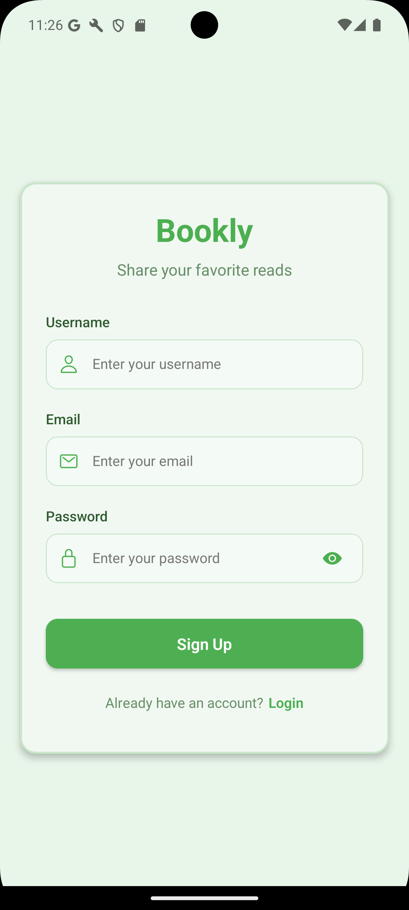
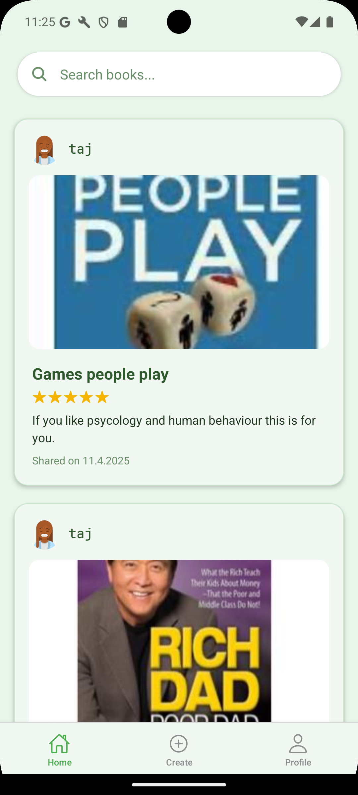
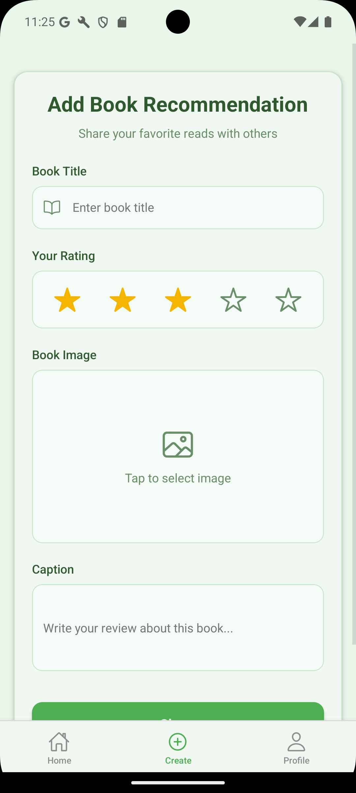
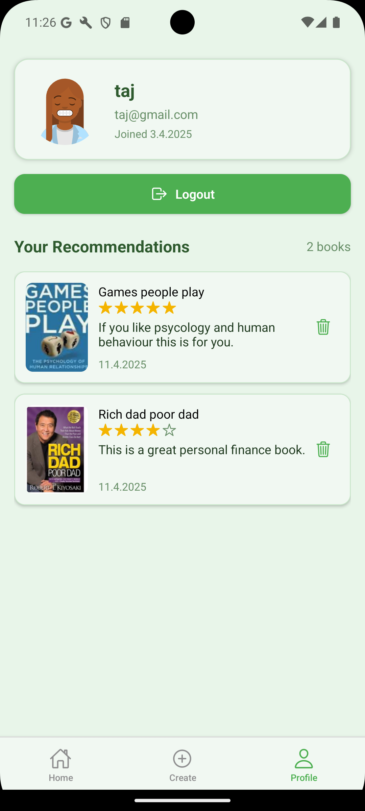

# 📚 Book Recommendation App

This is a cross-platform mobile application built with **React Native (Expo)** that allows users to **register, login, and share book recommendations**. Users can view recommendations from others, manage their own posts, and enjoy a seamless experience powered by modern technologies like **Zustand**, **MongoDB**, **Express.js**, and **Node.js**.

---

## 🚀 Features

- 🔐 **Authentication**
  - User Registration & Login
- ✍️ **Book Recommendations**
  - Create a new recommendation
  - View other users' recommendations
  - Manage your own posts
- 🌐 **Global State Management**
  - Powered by Zustand for simple and scalable state handling
- 🛠 **Backend**
  - Built with Node.js, Express.js, and MongoDB

---

## 🖼 App Screenshots

<p align="center">
  
  
  
  
  
</p>


---

## 🧰 Tech Stack

### Frontend:
- **React Native (Expo)**
- **Zustand** (State Management)

### Backend:
- **Node.js**
- **Express.js**
- **MongoDB**

---

## 🛠 Setup Instructions

### 1. Clone the Repository

To test the app on a physical device, make sure you have the **Expo Go** app installed from the [App Store](https://apps.apple.com/app/expo-go/id982107779) or [Google Play](https://play.google.com/store/apps/details?id=host.exp.exponent). Once the Expo development server is running (`npx expo start`), scan the QR code with Expo Go to launch the app on your phone.


```bash
git clone https://github.com/mybrudda/bookapp.git
cd bookapp
cd mobile
npm install
npx expo start
